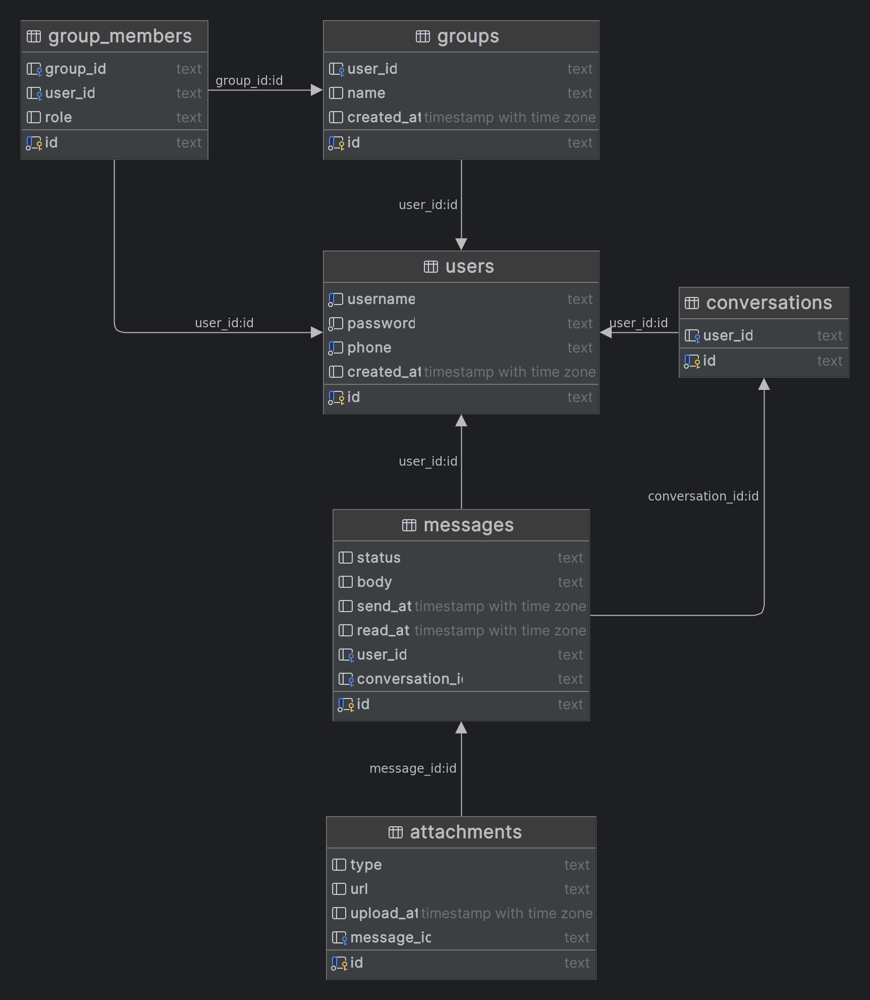

# Golang initdb and maxprofit

Project golang untuk membuat schema dari basic chat system dengan database postgreSQL

## Run Locally

Clone the project

```bash
  git clone https://github.com/Garongan/golang-chat.git
```

Go to the project directory

```bash
  cd golang-chat
```

Start the the project

```bash
  go run .
```

## Environment Variables Package initdb

Konfigurasi default untuk menjalankan package initDB adalah: (Perlu diperhatikan package ini akan membuat otomatis tabel baru dan relasinya ketika semua variable terpenuhi)

`host = localhost`

`port = 5432`

`dbname = go_chat_api`

`user = postgres`

`password = postgres`

`user = postgres`

## Erd dari database schema



## Usage/Examples initdb package

```go
// untuk migrasi database schema

import "golang-chat/initdb"

// akan membuat table baru di database sesuai dengan schema yang sudah ditentukan, 
// apabila sudah terdapat table dengan nama yang sama maka tetap membuat table baru
initdb.InitDb()
// expected output: Database initialized successfully
```

## Usage/Examples maxprofit package

```go
// untuk migrasi database schema

import "golang-chat/maxprofit"

// get max profit from stock prices
stokPrices := []int{3, 2, 6, 5, 1, 3} // sample price dari saham pada setiap harinya
maxTransaction := 2 // transaksi maksimal yang diperbolehkan

maxprofit := maxprofit.MaxProfit(stokPrices, maxTransaction)

// Menghitung dan mencetak keuntungan maksimal
fmt.Println("Keuntungan maksimal yang dapat diperoleh:", maxprofit)
// expected output: 3
```